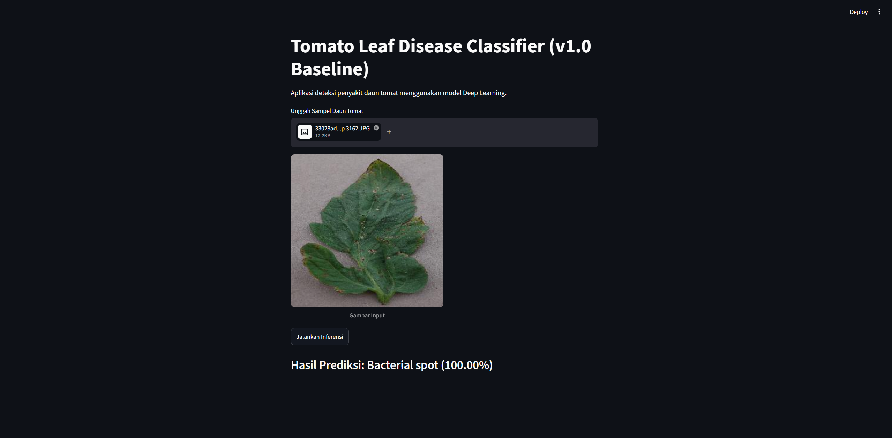

# Tomato Leaf Disease Classifier — Web Deployment

Aplikasi berbasis web menggunakan Streamlit untuk mengklasifikasi 10 jenis kondisi/penyakit daun tomat dengan membandingkan dua arsitektur Deep Learning: **TomatoCustomCNN (Scratch CNN)** dan **ResNet18 (Transfer Learning)**.

---

## Tabel Versioning Deployment

Sesuai kriteria penugasan MLOps, berikut dokumentasi iterasi pembaruan fitur aplikasi:

| Versi | Fitur & Perubahan Utama | Detail Desain / Optimasi | Dokumentasi Visual |
| :---: | :--- | :--- | :---: |
| **v1.0** | • Baseline deployment single-model.<br>• Output prediksi dan keyakinan teks sederhana. | Layout 1 kolom standar, belum ada benchmark latensi. |  |


---

## Panduan Menjalankan Lokal

1. **Clone repositori:**
   ```bash
   git clone <URL_REPO_ANDA>
   cd mbc-plant-classifier